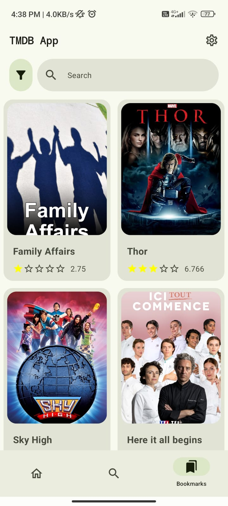
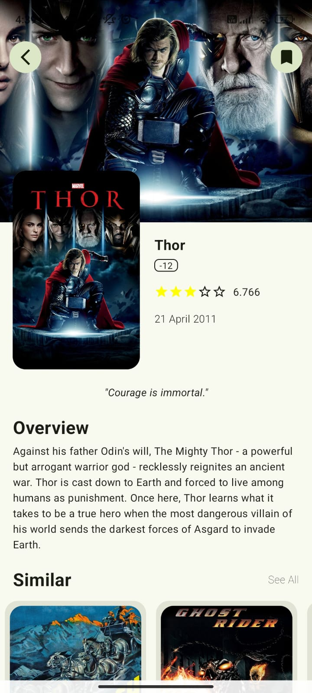
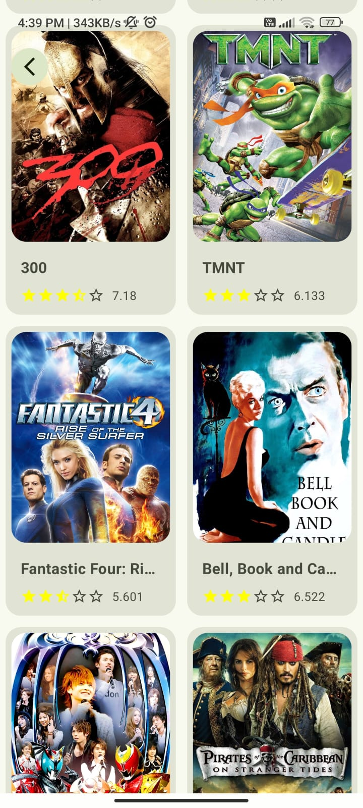
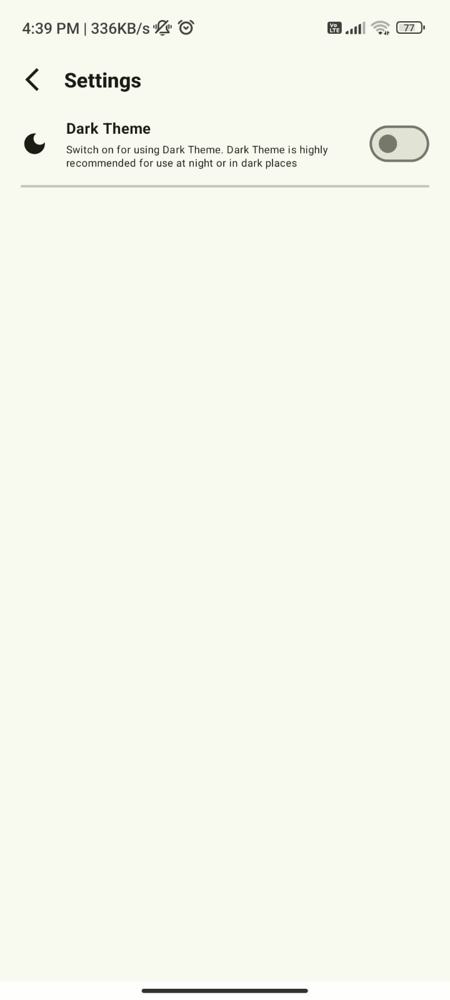
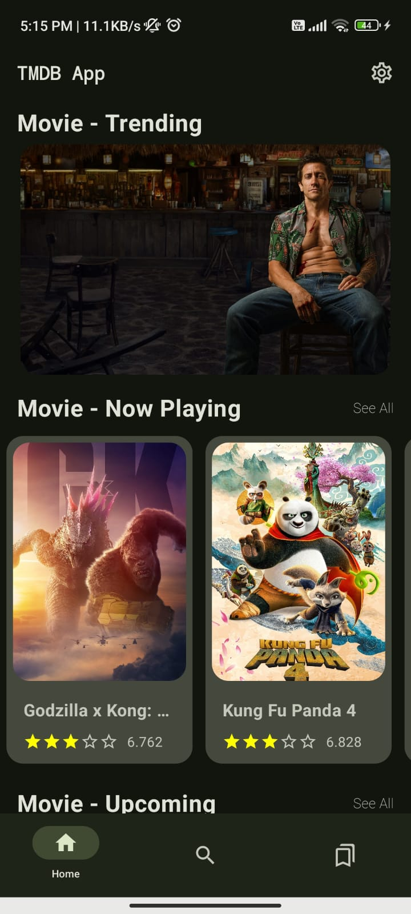
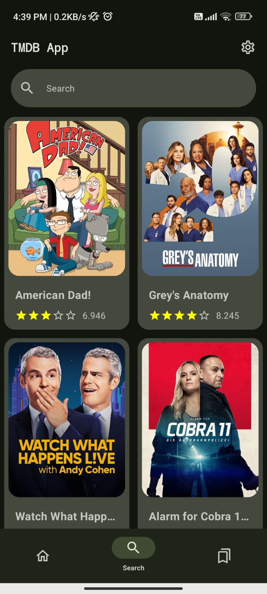
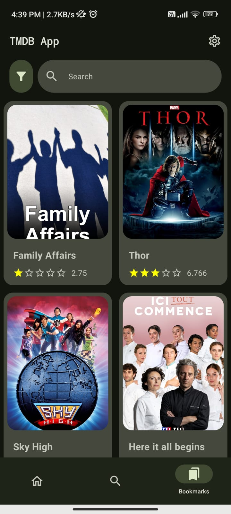
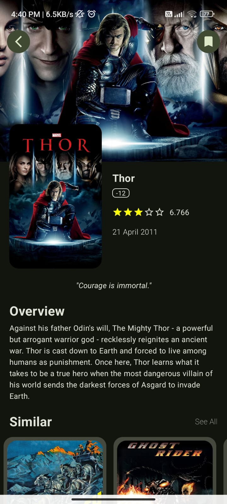
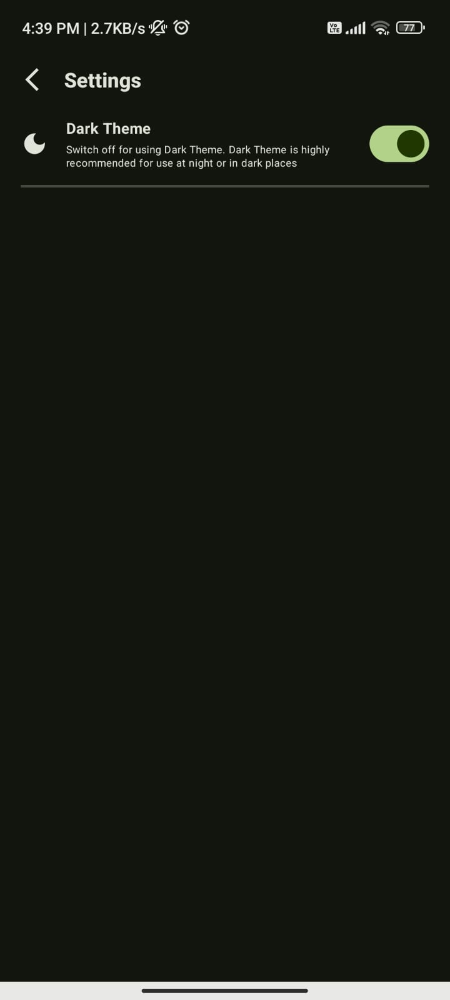

# TMDB App

## Screenshot
|Light - Home Screen|Light - Search Screen|Light - Bookmarks Screen|
|--|--|--|
||||

|Light - Detail Screen|Light - List Movie/Tv Series Screen|Light - Settings Screen|
|--|--|--|
||||

|Dark - Home Screen|Dark - Search Screen|Dark - Bookmarks Screen|
|--|--|--|
||||

|Dark - Detail Screen|Dark - List Movie/Tv Series Screen|Dark - Settings Screen|
|--|--|--|
||||

## Features
- List Movie / Tv Series Trending / Upcoming / Now Playing
- Search Movie / Tv Series
- Bookmark Movie / Tv Series
- Search in Bookmark Movie / Tv Series
- Filter in Bookmark Movie / Tv Series
- Light or Dark Theme

## Layers
- **Domain** - It's core of the application and contains the business rules and application logic.
- **Data** It responsible for all matters related to data management in the application. It includes communication with external resources such as databases, network APIs, local storage, and other resources.
- **Presentation** - A layer that interacts with the UI, mainly Android Stuff like Component Screen, ViewModel, etc. It would include both domain and data layers.

## Build With
- [Kotlin](https://kotlinlang.org/) - First class and official programming language for Android development.
- [Jetpack Compose](https://developer.android.com/develop/ui/compose) - Android’s recommended modern toolkit for building native UI. It simplifies and accelerates UI development on Android. Quickly bring your app to life with less code, powerful tools, and intuitive Kotlin APIs.
- [Coroutines](https://kotlinlang.org/docs/reference/coroutines-overview.html) - Is light wight threads for asynchronous programming.
- [Flow](https://developer.android.com/kotlin/flow) - Handle the stream of data asynchronously that executes sequentially.
- [Android Architecture Components](https://developer.android.com/topic/libraries/architecture) - Collection of libraries that help you design robust, testable, and maintainable apps.
    - [ViewModel](https://developer.android.com/topic/libraries/architecture/viewmodel) - Stores UI-related data that isn't destroyed on UI changes.
    - [Room](https://developer.android.com/topic/libraries/architecture/room) - SQLite object mapping library.
    - [Paging 3](https://developer.android.com/topic/libraries/architecture/paging/v3-overview) - The Paging library helps you load and display pages of data from a larger dataset from local storage or over a network.
- [Dependency Injection](https://developer.android.com/training/dependency-injection) - dependency injection is a technique where by one object (or static method) supplies the dependencies of another object. A dependency is an object that can be used (a service).
    - [Hilt-android](https://dagger.dev/hilt/) - Hilt provides a standard way to incorporate Dagger dependency injection into an Android application.
- [Retrofit](https://square.github.io/retrofit/) - A type-safe HTTP client for Android and Java.
- [OkHttp](http://square.github.io/okhttp/) - An HTTP & HTTP/2 client for Android and Java applications.
- [Gson](https://github.com/google/gson) - A Java serialization/deserialization library to convert Java Objects into JSON and back.
- [Material Design](https://material.io/develop/android/docs/getting-started) - Material is a design system created by Google to help teams build high-quality digital experiences for Android, iOS, Flutter, and the web.
- [Coil](https://coil-kt.github.io/coil/) - An image loading library for Android backed by Kotlin Coroutines.